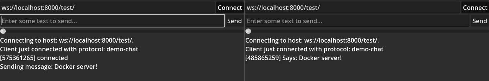

# godot-server
Demonstration of creating Docker image for websocket chat app.

# Server export and container creation
```bash
$ ./export.sh
```
# Run app
```bash
$ docker run -it -p 8000:8000 godot-server
```

